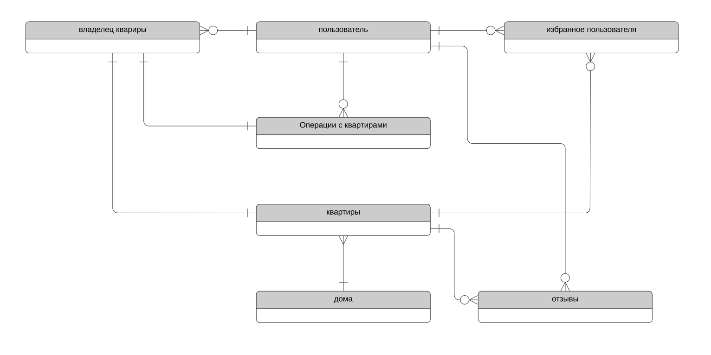
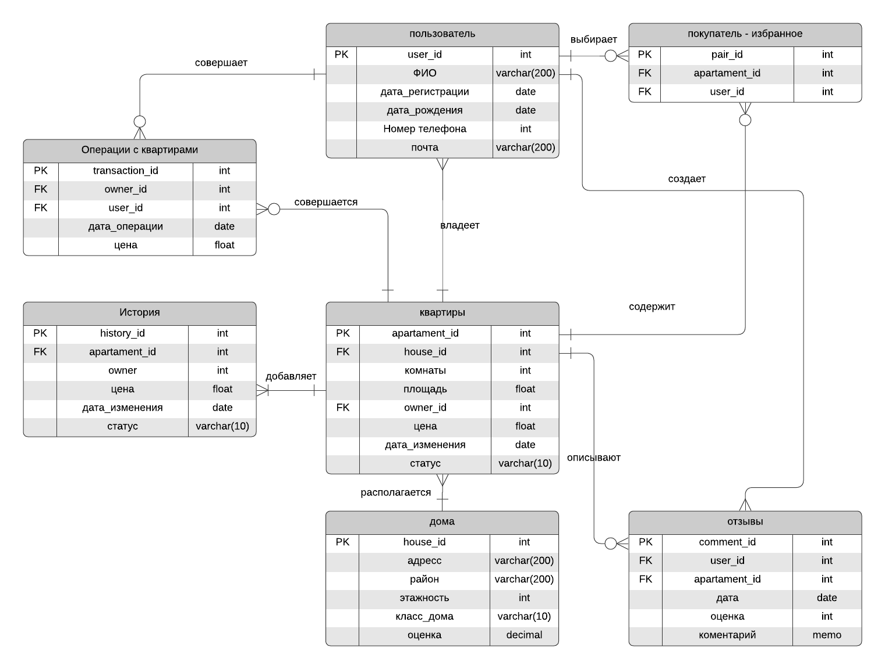

# База данных для онлайн сервиса по покупке, продаже и сдаче в аренду недвижимости
1. **Концептуальная модель**
  
2. **Логическая + физическая модель**
  
Для нормализации таблицы “избранное пользователя”, чтобы значения были скалярными, введена таблица покупатель-избранное, где фиксируется отдельно каждая пара пользователь - квартира, которую он добавил в избранное. Во всех остальных таблицах значения скалярные и строки в них уникальные, поэтому схема приведена в 1NF.
Так как все неключевые атрибуты зависят от первичного ключа, то база данных находится и в 2NF.
Для хранения изменений данных в таблице квартир используем 4 тип версионироваиня. Добавили отдельную таблицу “история”, в которой каждое изменение стоимости или статуса каждой квартиры будет фиксироваться и иметь свой идентификатор.

3. **Таблицы с описанием и ограничением для каждого атрибута**

|квартиры                                         |
| ------------------------------------------------|
| название  | описание | тип данных | ограничения |
| --------- | -------- | --------   |  --------   |
|apartament_id|идентификатор квартиры|int|primary key|
|house_id|индентификатор дома, в котором находится квартира|int|not null|
|rooms|количество комнат|int|not null, 1 <= rooms <= 30|
|area|площадь квартиры|float|not null, 0 < area <= 6500|

